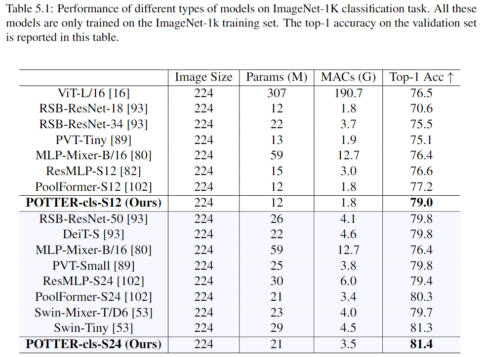
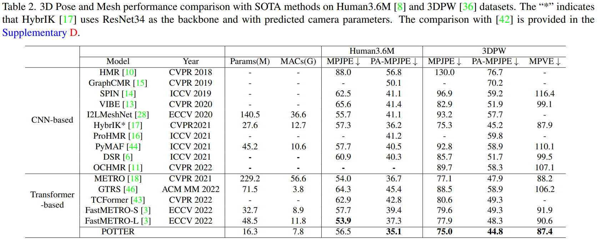
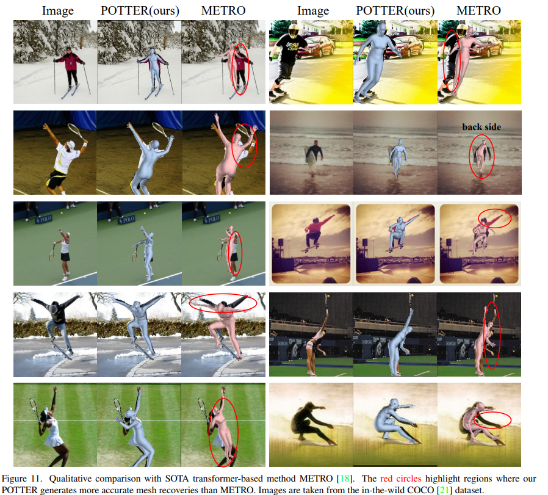

# POTTER: Pooling Attention Transformer for Efficient Human Mesh Recovery
The project is an official implementation of our paper [POTTER: Pooling Attention Transformer for Efficient Human Mesh Recovery](https://arxiv.org/pdf/2303.13357.pdf), CVPR 2023.

## News :triangular_flag_on_post:
Please check `image_classification` folder for Image Classification Part (Section 4.1 in our paper) and `human_mesh_recovery` folder for Human Mesh Recovery Part.  

## Experiments 

## Visualizations

## Citing
If our code helps your research, please consider citing the following paper:

    @inproceedings{zheng2023potter,
        title={POTTER: Pooling Attention Transformer for Efficient Human Mesh Recovery},
        author={Zheng, Ce and Liu, Xianpeng and Qi, Guo-Jun and Chen, Chen},
        booktitle={Proceedings of the IEEE/CVF Conference on Computer Vision and Pattern Recognition},
        year={2023}
    }
    
    @inproceedings{zheng2023feater,
        title={FeatER: An Efficient Network for Human Reconstruction via Feature Map-Based TransformER},
        author={Zheng, Ce and Mendieta, Matias and Yang, Taojiannan and Qi, Guo-Jun and Chen, Chen},
        booktitle={Proceedings of the IEEE/CVF Conference on Computer Vision and Pattern Recognition},
        year={2023}
    }
